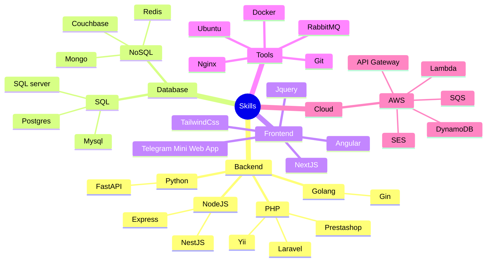

# Hi there 👋

I'm Hamid.
<!--
**isaachamid/isaachamid** is a ✨ _special_ ✨ repository because its `README.md` (this file) appears on your GitHub profile.

Here are some ideas to get you started:

- 🔭 I’m currently working on ...
- 🌱 I’m currently learning ...
- 👯 I’m looking to collaborate on ...
- 🤔 I’m looking for help with ...
- 💬 Ask me about ...
- 📫 How to reach me: ...
- 😄 Pronouns: ...
- ⚡ Fun fact: ...
-->

## 🌐 Socials:
 

# 💻 Tech Stack:
                                        
<!-- Proudly created with GPRM ( https://gprm.itsvg.in ) -->

- 2024/----: Senior Software Developer @ LuxReality
- 2023/2024: Senior Software Developer @ Whitefox
- 2022/2023: Full Stack Developer @ Across Group
- 2020/2022: IT Consultant and Senior Software Developer @ Mohsen Group
- 2019/2022: Senior Software Develope @ Brandsdistribution
- 2017/2018: Senior Software Developer @ Avval Market
- 2015/2017: Full Stack Developer @ Mabna
- 2014/2015: Software Developer @ Saman Portal
- 2013/2014: Full Stack Developer @ Tadbir Gostaran
- 2012/2013: Web Developer @ IdeBekr Mobin
- 2011/2012: Web Developer @ Avagostar
- 2010/2011: Windows Application Developer @ Pardazande Pars
- 2009/2011: Junior Software Developer @ FreelanceSelf

